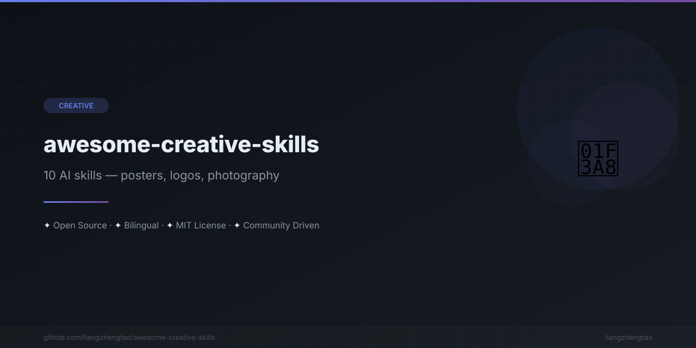

[English](README.md) | [中文](README.zh.md) | [日本語](README.ja.md) | [Français](README.fr.md) | [Español](README.es.md)

<div align="center">



</div>


# Awesome Creative Skills 🎨

> **写真をアートに変える。デザイナー、フォトグラファー、クリエイターのための10個のAIスキル。**

[](https://awesome.re)
[](CONTRIBUTING.md)
[](LICENSE)
[](#skills)

---


## ✨ これは何か

写真をアートに変える10個のAIスキル。映画ポスター、アルバムカバー、ロゴ、フィルムシミュレーションなど、各スキルはAIアシスタントにプロンプト、カラーパレット、ステップバイステップの指示を提供します。

[gathered-scenes-zine](https://github.com/nicholasgriffintn/gathered-scenes-zine) と [scene-distillation-zine](https://github.com/nicholasgriffintn/scene-distillation-zine) からインスピレーションを得て、より幅広いクリエイティブ領域をカバーしています。

## 🖼️ 変換例

```
生写真 → レトロ映画ポスター       生写真 → ヴィンテージ旅行ポスター
┌──────────┐   ┌──────────────┐    ┌──────────┐   ┌──────────────┐
│          │   │ ╔══════════╗ │    │          │   │  ╔════════╗  │
│  📷      │ → │ ║ 🎬 HERO  ║ │    │  📷      │ → │  ║ PARIS  ║  │
│  selfie  │   │ ║  MOVIE   ║ │    │  landmark │   │  ║ TRAVEL ║  │
│          │   │ ╚══════════╝ │    │          │   │  ╚════════╝  │
└──────────┘   └──────────────┘    └──────────┘   └──────────────┘

生写真 → アルバムカバー              生写真 → ブランドロゴ
┌──────────┐   ┌──────────────┐    ┌──────────┐   ┌──────────────┐
│          │   │ ┌──────────┐ │    │          │   │              │
│  📷      │ → │ │  ♪ ALBUM │ │    │  📷      │ → │    [LOGO]    │
│  portrait │   │ │   ART    │ │    │  sketch  │   │              │
│          │   │ └──────────┘ │    │          │   │              │
└──────────┘   └──────────────┘    └──────────┘   └──────────────┘
```

---

## 🎯 スキル一覧

| # | カテゴリ | スキル | 説明 |
|---|----------|-------|-------------|
| 1 | 🎬 ポスターデザイン | [レトロ映画ポスター](skills/海报设计/retro-movie-poster.md) | 1970〜80年代の映画ポスター美学、エアブラシ、ドラマチックなライティング |
| 2 | 🎬 ポスターデザイン | [ヴィンテージ旅行ポスター](skills/海报设计/travel-poster.md) | アールデコ、WPA時代の旅行ポスター、大胆な幾何学模様 |
| 3 | 🎬 ポスターデザイン | [音楽アルバムカバー](skills/海报设计/music-album-cover.md) | ジャンル別アルバムアート：ヒップホップ、エレクトロニック、ジャズ、ロック、クラシック |
| 4 | 📸 写真編集 | [フィルムシミュレーション](skills/摄影后期/film-emulation.md) | Kodak Portra、Fuji Velvia、Ilford HP5、Polaroid、Daguerreotype |
| 5 | 📸 写真編集 | [シネマティックグレーディング](skills/摄影后期/cinematic-grade.md) | ティール＆オレンジ、ブリーチバイパス、ブレードランナー2049、アメリ風 |
| 6 | 📸 写真編集 | [ライトペインティング](skills/摄影后期/light-painting.md) | ライトトレイル、スタートレイル、スチールウール、ネオンエフェクト |
| 7 | 🎨 ブランドデザイン | [ロゴ生成](skills/品牌设计/logo-generation.md) | ミニマル、幾何学、ワードマーク、ピクトリアル、抽象ロゴ |
| 8 | 🎨 ブランドデザイン | [ブランドアイデンティティ](skills/品牌设计/brand-identity.md) | 完全なビジュアルシステム：カラー、フォント、パターン、アプリケーション |
| 9 | 📱 ソーシャルメディア | [コンテンツクリエイターパック](skills/社交媒体/content-creator-pack.md) | Instagram、YouTube、Twitter、LinkedIn、TikTok、Pinterestデザイン |
| 10 | ✏️ イラスト制作 | [キャラクターデザイン](skills/插画创作/character-design.md) | アニメ、カートゥーン、ドット絵、リアル、ちび、マスコット、VTuberアバター |

---

## 🚀 クイックスタート

### Cursor

スキルファイルをプロジェクトの `.cursor/rules/` ディレクトリにコピー：

```bash
cp skills/海报设计/retro-movie-poster.md .cursor/rules/
```

CursorのAIアシスタントとの会話で参照してください。

### Claude Code

プロジェクトの `CLAUDE.md` に追加するか、`.claude/` にコピー：

```bash
# CLAUDE.md に追加
cat skills/摄影后期/film-emulation.md >> CLAUDE.md

# または直接参照
# "Using the film-emulation skill, apply Kodak Portra 400 look to this photo"
```

### Kimi Code

スキルファイルをプロジェクトにコピーして参照：

```bash
# プロジェクトにコピー
cp -r skills/ .kimi/skills/

# または会話で直接スキルを使用：
# "Apply the retro-movie-poster skill to transform this photo into a 1980s sci-fi poster"
```

### その他のAIアシスタント

各スキルファイルは独立したMarkdownドキュメントです。以下の使い方ができます：

1. **スキル全体を会話に貼り付けて**コンテキストとして使用
2. **特定のセクションを参照**（プロンプトテンプレート、スタイルガイド）
3. **複数のスキルを組み合わせて**複雑なプロジェクトに対応

---

## 📁 プロジェクト構成

```
awesome-creative-skills/
├── skills/
│   ├── 海报設計/                    # ポスターデザイン
│   │   ├── retro-movie-poster.md   # 1970〜80年代映画ポスタースタイル
│   │   ├── travel-poster.md        # アールデコ＆WPA旅行ポスター
│   │   └── music-album-cover.md    # マルチジャンルアルバムアート
│   ├── 摄影后期/                    # 写真編集
│   │   ├── film-emulation.md       # アナログフィルムシミュレーション
│   │   ├── cinematic-grade.md      # ハリウッドカラーグレーディング
│   │   └── light-painting.md       # 長時間露光ライティングエフェクト
│   ├── 品牌設計/                    # ブランドデザイン
│   │   ├── logo-generation.md      # 様々なスタイルのロゴ作成
│   │   └── brand-identity.md       # 完全なアイデンティティシステム
│   ├── 社交媒体/                    # ソーシャルメディア
│   │   └── content-creator-pack.md # マルチプラットフォームコンテンツデザイン
│   └── 插画創作/                    # イラスト
│       └── character-design.md     # キャラクター＆アバターデザイン
├── .github/
│   ├── workflows/ci.yml
│   ├── ISSUE_TEMPLATE/
│   │   └── request_skill.md
│   └── pull_request_template.md
├── README.md
├── CONTRIBUTING.md
├── CODE_OF_CONDUCT.md
├── SECURITY.md
├── CHANGELOG.md
├── LICENSE
└── .gitignore
```

---

## 🎨 スキル詳細

各スキルファイルは一貫した構造に従います：

- **使用タイミング** — スキルが適用される明確なトリガー
- **デザイン哲学** — コア原則と美学的決定
- **優先順位** — クリエイティブな優先事項の順序リスト
- **AIアシスタントへの指示** — ステップバイステップのワークフロー
- **プロンプトテンプレート** — カスタマイズ可能な変数付きの即座に使えるプロンプト
- **スタイルリファレンス** — カラーパレット、タイポグラフィ、構図ガイド
- **よくあるパターン** — 頻繁に使用されるアプローチ
- **避けるべき落とし穴** — よくあるミスとその回避方法

### 使用例

```
ユーザー：「この休暇の写真をWPA国立公園ポスターに変換して」

AI（travel-poster スキルを使用）：
→ ランドマークと風景を識別
→ ブロック印刷テクスチャのWPA時代スタイルを選択
→ 地域に適したアーストーンパレットを適用
→ 時代に合ったタイポグラフィを追加
→ ヴィンテージ旅行ポスターを出力
```

---

## 🔗 関連項目

AIスキルエコシステムの関連プロジェクト：

| プロジェクト | 説明 |
|---------|-------------|
| [awesome-skills](https://github.com/nicholasgriffintn/awesome-skills) | 汎用AIスキルコレクション |
| [awesome-video-skills](https://github.com/nicholasgriffintn/awesome-video-skills) | 動画編集・制作のためのAIスキル |
| [awesome-ai-rules](https://github.com/nicholasgriffintn/awesome-ai-rules) | 精選されたAIルールと設定 |
| [vibe-check](https://github.com/nicholasgriffintn/vibe-check) | AIスキルセットの検証とテスト |
| [commit-ai](https://github.com/nicholasgriffintn/commit-ai) | AI搭載コミットメッセージ生成 |
| [awesome-mcp-servers](https://github.com/nicholasgriffintn/awesome-mcp-servers) | AIツール向けMCPサーバーコレクション |

---

## 🤝 コントリビュート

コントリビューションを歓迎します！ガイドラインは [CONTRIBUTING.md](CONTRIBUTING.md) をご覧ください。

新しいクリエイティブスキルを追加したい場合は、[Issue](https://github.com/liangzhengtao/awesome-creative-skills/issues/new?template=request_skill.md) を作成するかPRを送信してください。

---

## 📄 ライセンス

[MIT](LICENSE) © [liangzhengtao](https://github.com/liangzhengtao)

---
